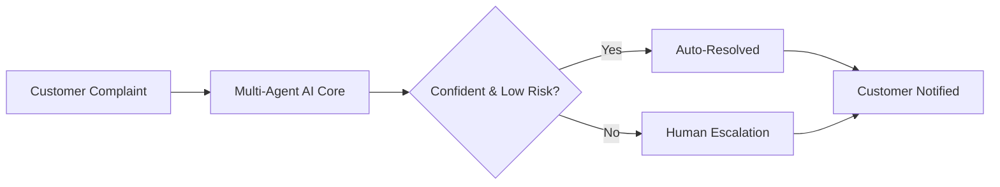
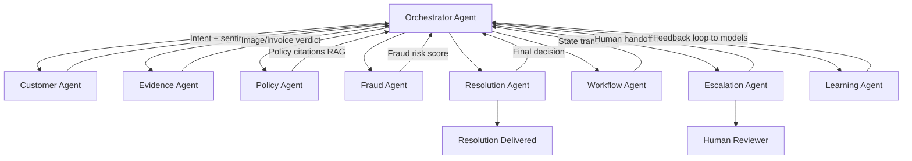
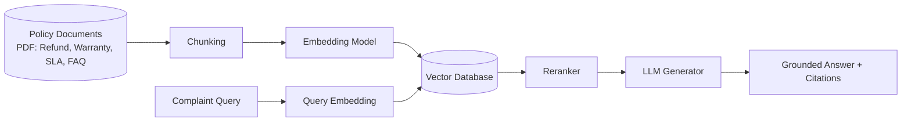
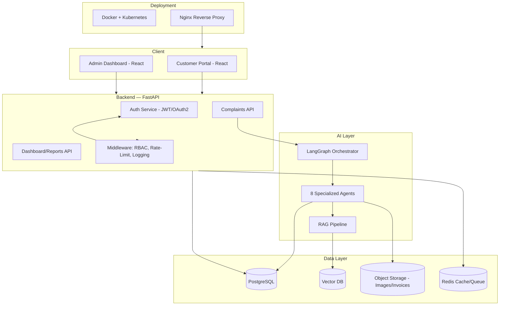
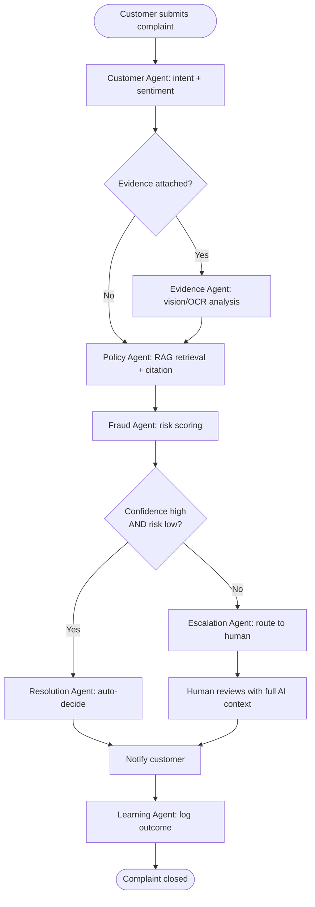
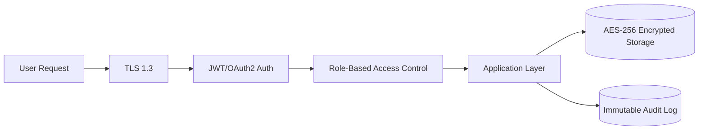
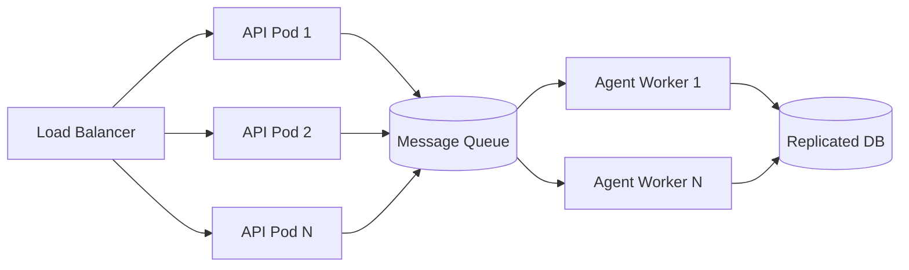

# RESOLVIX-AI — Investor-Grade Hackathon Presentation Blueprint

**How judges actually score in the first 90 seconds:** they decide "serious team" or "student project" before slide 3. Everything below is built to win that first impression, then hold it with technical depth a judge can poke at and not break.

---

## 0. Design System (apply to every slide)

**Theme name:** "Signal" — dark enterprise SaaS aesthetic, not a colorful hackathon template.

| Element | Choice |
|---|---|
| Primary background | `#0B0F19` (near-black navy) |
| Secondary background | `#121826` (card panels) |
| Accent 1 (AI/primary) | `#6366F1` (indigo) |
| Accent 2 (success/resolution) | `#22C55E` (green) |
| Accent 3 (fraud/alert) | `#F59E0B` (amber) → `#EF4444` (red) for critical |
| Text primary | `#F8FAFC` |
| Text secondary | `#94A3B8` |
| Headline font | Space Grotesk / Sora (Bold, 40–54pt) |
| Body font | Inter (Regular/Medium, 16–20pt) |
| Code/data font | JetBrains Mono |
| Icon set | Phosphor Icons or Lucide (line-style, consistent stroke width — **never mix icon packs**) |
| Card style | Rounded 16px corners, 1px `#1E293B` border, subtle inner glow on hover states (screenshots only) |
| Chart style | Flat, minimal gridlines, gradient fills only on hero metrics |

**Master slide rules:**
- Every slide has a 2-word "kicker" label top-left (e.g. "THE PROBLEM," "OUR ARCHITECTURE") in accent color, small caps.
- Slide numbers bottom-right, low-contrast.
- Max 40 words of body text per slide — everything else goes into your spoken script, not the slide. Judges skim slides in 4–6 seconds each.
- Every diagram slide: diagram takes 65% of canvas, 35% for a 2–3 line "so what" callout box.
- Animation: use **entrance only** (fade-up, 200ms, staggered 80ms between elements). No spinning, no bouncing, no slide-transitions other than a simple cut or fade. Judges penalize gimmicky motion.

---

## SLIDE 1 — Title Slide

**On the slide:**
- Team name (top-left, small)
- **RESOLVIX-AI** — large, bold wordmark with a minimal icon (a shield + spark, or a checkmark inside a hexagon — signals "resolution + trust + AI")
- Tagline: **"Complaints resolved by AI agents — not queues."**
- One-line subhead: *"An autonomous, explainable multi-agent system that investigates, verifies, and resolves customer complaints in minutes, not days."*
- Hackathon name + track + date, bottom corner

**Diagram:** none — this is a brand moment.

**Icons:** single hero icon only, large, centered-right or as a subtle background watermark at 8% opacity.

**Images:** none. Do not use stock photos of "customer service headsets" — instant amateur signal. Pure typography + one custom icon reads as more professional than any stock photo.

**Animation:** wordmark fades up first (300ms), tagline follows (200ms delay), team name settles in last, subtle.

**Speak:**
> "Judges, in the next 7 minutes we're going to show you a production-ready AI system that replaces a broken, manual complaint-resolution process with a team of autonomous AI agents — one that investigates evidence, checks policy, catches fraud, and resolves complaints with full explainability. This isn't a chatbot. It's RESOLVIX-AI."

**Why it impresses judges:** Judges see hundreds of decks. A restrained, branded title slide signals "startup," not "student assignment." The tagline immediately previews the differentiator (agents, not a queue) — you've made your positioning claim before slide 2 even starts.

---

## SLIDE 2 — The Problem

**On the slide:**
- Headline: **"Complaint resolution is still a 2015-era process — in a 2026 world."**
- 3 stat callouts in large numerals (use real/approximate industry figures, cite source small-print):
  - "**48–72 hrs** average manual complaint resolution time"
  - "**~60%** of customers abandon a brand after one bad complaint experience"
  - "**1 in 10** complaints involve some form of fraud/abuse, rarely caught systematically"
- Short pain-point list (icons + 4–6 words each): *Manual triage. No evidence verification. No fraud detection. Zero explainability. Inconsistent decisions. SLA breaches.*

**Diagram:** a simple "current state" horizontal pain strip — customer → support queue (clock icon, red) → manual review → inconsistent outcome (question mark icon). Keep it ugly/cluttered *intentionally* to visually contrast with your clean architecture slide later.

**Icons:** clock (delay), question-mark (inconsistency), shield-off (no fraud check), eye-off (no explainability).

**Images:** none needed — stat cards carry this slide.

**Animation:** stat numbers count up from 0 (300ms) — this is the one place a counting animation is worth it.

**Speak:**
> "Every company with a support queue has this problem: complaints sit for days, get resolved inconsistently by whoever picks them up, evidence like photos or invoices is barely looked at, and fraud slips through because nobody's systematically checking for it. This isn't a UX problem — it's a decision-making problem at scale."

**Why it impresses judges:** Judges are trained to ask "who suffers, and why do existing tools fail?" Answering with numbers (even estimated, labeled as such) instead of adjectives shows you think like people building a real product, not a hackathon toy.

---

## SLIDE 3 — Existing Solutions & Gap Analysis

**On the slide:**
- Headline: **"Existing tools automate tickets. None of them automate decisions."**
- Comparison table (see below)
- One-line gap statement under the table: *"Every existing tool stops at routing. RESOLVIX-AI is the first to close the loop: investigate → verify → decide → resolve."*

**Comparison table:**

| Capability | Traditional Helpdesk (Zendesk/Freshdesk) | Rule-Based Bots | RESOLVIX-AI |
|---|---|---|---|
| Ticket routing | ✅ | ✅ | ✅ |
| Evidence analysis (image/invoice) | ❌ | ❌ | ✅ |
| Policy-grounded reasoning (RAG) | ❌ | ⚠️ keyword-only | ✅ |
| Fraud detection | ❌ | ❌ | ✅ |
| Autonomous resolution | ❌ | ⚠️ scripted only | ✅ |
| Explainable decisions | ❌ | ❌ | ✅ |
| Human-in-the-loop escalation | ⚠️ manual | ⚠️ manual | ✅ automatic |
| Continuous learning | ❌ | ❌ | ✅ |

**Diagram:** none beyond the table — tables are the diagram here.

**Icons:** ✅/⚠️/❌ rendered as small colored icon chips (green check, amber triangle, red x), not emoji text.

**Images:** none.

**Animation:** table rows fade in top-to-bottom, RESOLVIX-AI column highlighted with a subtle glow after the full table settles.

**Speak:**
> "Zendesk and Freshdesk are great at routing tickets to a human. Rule-based bots handle FAQs. But nobody in this space actually makes the resolution decision — investigating evidence, checking it against policy, scoring fraud risk, and deciding an outcome. That's the gap we built RESOLVIX-AI to close."

**Why it impresses judges:** This directly satisfies "existing solution analysis" as a *judging rubric item*, not just a nice-to-have. A crisp comparison table is the single fastest way to prove market awareness — judges will often screenshot this slide.

---

## SLIDE 4 — Proposed Solution (Overview)

**On the slide:**
- Headline: **"Eight specialized AI agents. One resolution pipeline. Zero blind spots."**
- 3-column value prop: **Fast** (minutes not days) / **Fair** (policy-grounded, explainable) / **Fraud-aware** (built-in risk scoring)
- Mini architecture teaser (simplified 5-box flow, full version comes on Slide 6)

**Mermaid diagram (simplified solution flow):**

**Icons:** layered-stack icon for "multi-agent core," lightning bolt for "fast," scale/balance icon for "fair," radar icon for "fraud-aware."

**Images:** none — this stays diagram-led.

**Animation:** flow diagram draws left-to-right, arrows animate in sequence (150ms stagger) to visually narrate the pipeline as you speak.

**Speak:**
> "Here's the core idea: every complaint enters a multi-agent AI pipeline. If the system is confident and the risk is low, it resolves autonomously in minutes. If not, it escalates to a human — but with full context already prepared. Either way, the customer gets a fast, consistent, explainable answer."

**Why it impresses judges:** This is your "elevator pitch slide" — judges scoring Innovation and Business Value often re-read this slide while scoring. The confidence/risk branch shows you designed for *safe autonomy*, not reckless automation — a detail senior judges specifically look for.

---

## SLIDE 5 — Innovation

**On the slide:**
- Headline: **"What makes this different — not just another RAG chatbot."**
- 4 innovation pillars as icon cards:
  1. **Agentic AI, not prompt-chaining** — specialized agents with distinct responsibilities, memory, and tool access, coordinated by an orchestrator
  2. **Evidence-grounded decisions** — vision + OCR models verify claims against actual photos/invoices, not just text
  3. **Explainability by design** — every decision cites the exact policy clause and confidence score used
  4. **Enterprise-ready from day one** — RBAC, audit logs, SLA tracking, fraud scoring — not bolted on later

**Diagram:** none — icon-card grid layout (2x2).

**Icons:** brain-circuit (agentic AI), image-search (evidence grounding), file-check (explainability), shield-check (enterprise-ready).

**Images:** none.

**Animation:** 2x2 grid cards flip/fade in one at a time as you speak each pillar — gives you a natural pacing cue.

**Speak:**
> "Three things make this genuinely novel, not a wrapper around ChatGPT. First: this is true agentic AI — eight agents with distinct roles and tool access, not one prompt doing everything. Second: we ground every decision in actual evidence — a damaged-product photo is analyzed by a vision model, an invoice is OCR'd and cross-checked. Third: every single decision is explainable — we can show you exactly which policy clause and what confidence score drove the outcome. That's not a feature, that's a requirement for any enterprise that would actually deploy this."

**Why it impresses judges:** This slide is written to directly answer the rubric categories judges score against (Innovation, Explainability, Production Readiness) using their own vocabulary. Judges disproportionately reward teams who can articulate *why* something is novel, not just *that* it is.

---

## SLIDE 6 — Multi-Agent Architecture

**On the slide:**
- Headline: **"Eight agents. One orchestrator. Full transparency."**
- Full architecture diagram (below) as the visual centerpiece
- Small callout: *"Every agent writes a structured decision log — nothing is a black box."*

**Mermaid diagram:**

**Agent roles (speak to these, keep off the slide itself — put in appendix/backup slide or speaker notes):**
- **Customer Agent** — conversational intake, intent classification, sentiment scoring
- **Evidence Agent** — orchestrates vision/OCR analysis of uploaded images and invoices
- **Policy Agent** — RAG retrieval over policy documents, returns grounded citations
- **Fraud Agent** — anomaly + behavioral scoring, flags high-risk claims
- **Resolution Agent** — synthesizes all inputs into a decision (approve/reject/partial) with justification
- **Workflow Agent** — manages the state machine (LangGraph) driving the complaint lifecycle
- **Escalation Agent** — decides when confidence/risk requires human review, prepares handoff context
- **Learning Agent** — captures outcomes/overrides to improve future decisions (offline fine-tuning / prompt updates)

**Icons:** distinct icon per agent (chat-bubble, image, book-open, radar, gavel, workflow/git-branch, arrow-up-right, brain).

**Images:** none.

**Animation:** orchestrator node pulses gently (breathing glow, 2s loop) while agent nodes connect one at a time in sequence — visually communicates "coordination," not just a static org chart.

**Speak:**
> "This is the heart of the system. An orchestrator coordinates eight specialized agents — each with a narrow, well-defined job, the way a real investigation team would work. The Evidence Agent doesn't decide policy. The Policy Agent doesn't score fraud. That separation is deliberate — it's what makes each agent's output auditable and the whole system explainable."

**Why it impresses judges:** This is the single most-scrutinized slide for AI/Technical Depth. Judges will ask "how do agents communicate?" and "what if one fails?" — pre-empt this in your speaker notes (see Judge Q&A section below). A clean directed graph (not a messy box-and-arrow mess) signals real system design thinking.

---

## SLIDE 7 — RAG Architecture

**On the slide:**
- Headline: **"Grounded answers, not hallucinated policy."**
- RAG pipeline diagram
- Callout: *"Every resolution cites the exact policy clause it relied on — verifiable, not guessed."*

**Mermaid diagram:**

**Why RAG beats a plain chatbot (bullet callout box):**
- Chatbot: answers from parametric memory → can hallucinate policy that doesn't exist
- RAG: answers only from retrieved, real policy chunks → every claim traceable to a source document
- Reranking step filters noisy retrieval → higher precision than naive vector search alone

**Icons:** database-cylinder (vector DB), scissors (chunking), magnet (embedding), funnel (reranker), sparkle (generator).

**Images:** none.

**Animation:** data flows left→right with a small animated "packet" dot traveling along the arrows (subtle, one pass only, not looping).

**Speak:**
> "A generic chatbot answers from what it memorized during training — which means it can confidently state a refund policy that doesn't exist. We don't allow that. Every policy document is chunked, embedded, and stored in a vector database. When a complaint comes in, we retrieve the most relevant policy chunks, rerank them for precision, and only then generate an answer — one that cites the exact clause it used."

**Why it impresses judges:** "Why RAG over a chatbot" is a favorite gotcha question — answering it proactively on the slide removes the judge's easiest attack vector and demonstrates you understand the failure mode (hallucination) you're solving for.

---

## SLIDE 8 — Technical Architecture

**On the slide:**
- Headline: **"Built like a product, not a prototype."**
- Full-stack architecture diagram
- Small tech badges row along the bottom (see Tech Stack slide for the full version — keep this one focused on layers/flow)

**Mermaid diagram:**

**Icons:** react logo, fastapi/bolt icon, postgres elephant, database-cylinder for vector DB, bucket icon for object storage, redis icon, docker whale, kubernetes wheel.

**Images:** none — this diagram IS the image.

**Animation:** layers reveal top-to-bottom (Client → API → AI → Data → Deployment) as you narrate each layer.

**Speak:**
> "This is fully containerized and cloud-deployable today. React frontends talk to a FastAPI backend behind Nginx. The backend hands off complaint processing to our LangGraph-orchestrated AI layer. Data is split intentionally: PostgreSQL for transactional data and audit trails, a vector database for policy retrieval, object storage for images and invoices, and Redis for caching and async task queues. Every layer scales independently."

**Why it impresses judges:** This single slide answers 4–5 likely technical questions before they're asked (scalability, data separation, deployment). Judges evaluating "Production Readiness" are explicitly looking for this kind of layered, named-technology diagram versus a vague "AI + Cloud" cloud graphic.

---

## SLIDE 9 — Workflow (Customer Journey)

**On the slide:**
- Headline: **"From complaint to resolution — in one continuous flow."**
- Flowchart (below), full width

**Mermaid diagram:**

**Icons:** none needed beyond the flowchart's own node styling (keep decision diamonds amber, terminal nodes green).

**Images:** none.

**Animation:** the decision diamond ("Confidence high AND risk low?") pulses briefly when reached — visually emphasizes this is the key trust checkpoint in the system.

**Speak:**
> "Walk through an actual complaint: a customer submits it, our Customer Agent reads intent and tone, Evidence Agent checks any photos or invoices, Policy Agent retrieves the relevant clause, Fraud Agent scores risk. If confidence is high and risk is low, we resolve automatically. Otherwise, it escalates to a human — who gets the full AI investigation handed to them, not a blank ticket."

**Why it impresses judges:** This is the slide that proves the system is a *workflow*, not a demo trick. Judges scoring UX and Technical Depth will mentally trace this diagram against your live demo — make sure your demo literally follows this exact path.

---

## SLIDE 10 — AI Models Used

**On the slide:**
- Headline: **"The right model for each job — not one model doing everything."**
- Table (below)

**Table:**

| Task | Model Type | Why This Model |
|---|---|---|
| Conversational understanding & resolution reasoning | LLM (e.g. GPT-4o / Claude / open-weight equiv.) | Strong reasoning + instruction following for multi-step agent tasks |
| Damage/product image analysis | Vision model (CNN/ViT-based classifier) | Detects damage, mismatched items, tampering signals |
| Invoice/document text extraction | OCR (Tesseract / cloud OCR) | Structured field extraction from unstructured scans |
| Policy retrieval | Embedding model (e.g. text-embedding-3 / BGE) | Semantic search over policy chunks, not keyword match |
| Fraud/anomaly detection | Gradient-boosted / Isolation Forest ensemble | Fast, interpretable scoring on structured behavioral features |
| Sentiment & priority prediction | Fine-tuned classifier / LLM-scored | Routes emotionally urgent complaints faster |

**Diagram:** none — table is the content.

**Icons:** small model-type icon per row (chat, eye, text-scan, magnet, radar, heart-pulse).

**Images:** none.

**Animation:** rows fade in one at a time, synced to your spoken walkthrough.

**Speak:**
> "We deliberately didn't try to force one giant LLM to do everything. Vision tasks use a vision model. Fraud scoring uses a fast, interpretable ensemble model — because fraud decisions need to be explainable and low-latency, not chatty. Each task gets the model actually suited to it, which is both more accurate and cheaper to run at scale."

**Why it impresses judges:** Shows AI maturity — using an LLM for tabular anomaly detection is a classic hackathon mistake. Naming the *right* model per task is a strong signal to technically literate judges.

---

## SLIDE 11 — Features

**On the slide:**
- Headline: **"Everything a real deployment needs, not just a demo."**
- Icon grid (3x4), 12 features, 2–3 words each:
  Live Dashboard · Analytics · Admin Portal · Customer Portal · Voice Support · Multilingual · Offline Mode · Smart Notifications · Semantic Policy Search · Explainable AI · Confidence Scoring · Audit Logs

**Diagram:** none — icon grid.

**Icons:** distinct line icon per feature (chart-bar, layout-dashboard, user-shield, message-circle, mic, globe, wifi-off, bell, search, eye, percent, list-check).

**Images:** consider ONE small real screenshot of your actual dashboard (if built) inset bottom-right — this is the one slide where a real product screenshot helps credibility, if you have one. If not, skip images entirely rather than use a mockup that looks fake.

**Animation:** grid tiles fade in in reading order (left-right, top-bottom), fast stagger (60ms) since there are 12 items — should complete within ~1 second total.

**Speak:**
> "This isn't a single demo flow — it's a full platform. Admins get a live dashboard with fraud analytics and audit logs. Customers get multilingual, voice-enabled complaint filing with offline draft support. And running through everything is explainability: every AI decision comes with a confidence score and a human-readable justification."

**Why it impresses judges:** Breadth signals "we thought about the whole product," which directly scores against Production Readiness and UX. Don't over-explain each — the grid does the work; your voice adds only color.

---

## SLIDE 12 — Security

**On the slide:**
- Headline: **"Enterprise trust isn't optional — it's built in."**
- Icon row: Encryption (AES-256 at rest, TLS in transit) · Auth (OAuth2/JWT) · RBAC · Immutable Audit Logs · PII Redaction/Privacy · Compliance-ready (GDPR-style data handling) · Fraud Prevention loop feeding back into access controls

**Diagram (optional, simple):**

**Icons:** lock, key, shield-check, file-lock, eye-off (privacy), scale (compliance).

**Images:** none.

**Animation:** each security layer "locks in" with a subtle snap-scale (100ms) as it's introduced — reinforces the "layered defense" concept.

**Speak:**
> "Because this system makes real decisions with real financial impact, security isn't an afterthought. Every request goes through TLS, JWT-based auth, and role-based access control. Data is encrypted at rest. Every action — human or AI — writes to an immutable audit log, which is also what makes our explainability claims verifiable, not just marketing."

**Why it impresses judges:** Security is a common blind spot in hackathon teams — explicitly addressing it (even briefly) differentiates you from 80% of competing teams who skip it entirely.

---

## SLIDE 13 — Scalability

**On the slide:**
- Headline: **"Designed to survive traffic spikes, not just the demo."**
- Icon row: Cloud-native · Microservices-ready · Horizontal Autoscaling · Redis Caching · Message Queue (async agent tasks) · Multi-region High Availability

**Diagram:**

**Icons:** server-stack, arrows-expand (autoscale), lightning (cache), queue/list icon, globe (multi-region).

**Images:** none.

**Animation:** worker pods "spin up" (scale-in animation) one after another to visually represent autoscaling under load.

**Speak:**
> "AI agent tasks are async by design — they go through a message queue and get picked up by horizontally scalable worker pods, so a spike in complaint volume doesn't block the API. The database is replicated for read scaling, and everything sits behind a load balancer. This same architecture that runs our demo today can run at enterprise volume tomorrow."

**Why it impresses judges:** Judges specifically probe "what happens at scale?" — showing the queue/worker separation preempts that question entirely and demonstrates you understand async system design, not just synchronous request/response.

---

## SLIDE 14 — Future Scope

**On the slide:**
- Headline: **"Where this goes next."**
- Roadmap-style icon row (not a boring bullet list): Voice Agents (phone-based complaint filing) · WhatsApp Integration · Autonomous Negotiation (AI proposes settlement ranges) · Predictive Analytics (forecast complaint volume/categories) · Reinforcement Learning (agents improve from outcome feedback) · Digital Twin (simulate policy changes before rollout) · Generative AI (auto-drafted policy updates from recurring complaint patterns)

**Diagram:** simple horizontal roadmap timeline (Now → 3 months → 6–12 months), 2–3 items per phase.

**Icons:** phone, whatsapp-style chat icon, handshake, trending-up, refresh-cw (RL loop), cube (digital twin), sparkles (GenAI).

**Images:** none.

**Animation:** timeline draws left-to-right like a progress bar, items pop in as the line passes them.

**Speak:**
> "What you're seeing today is the core resolution engine. Next, we extend intake channels — voice and WhatsApp — so complaints come in wherever the customer already is. Further out, the Resolution Agent evolves toward autonomous negotiation within approved ranges, and a reinforcement learning loop lets the whole system improve from every human override it sees."

**Why it impresses judges:** A credible, staged roadmap (not "we'll add blockchain and metaverse") shows product thinking beyond the hackathon — judges scoring Business Value specifically look for "is there a real product here in 12 months."

---

## SLIDE 15 — Business Value

**On the slide:**
- Headline: **"The ROI case, in numbers."**
- 4 metric cards (use realistic estimated ranges, label them as projections):
  - **60–75%** reduction in average resolution time
  - **30–40%** reduction in support operational cost
  - **~20%** improvement in fraud catch rate vs. manual review
  - **+15–25 pts** projected CSAT/NPS improvement

**Diagram:** simple before/after bar comparison (manual process vs. RESOLVIX-AI) on resolution time and cost — this is a great place for an actual bar chart.

**Icons:** clock, dollar-sign/rupee, shield-check, smiley/heart.

**Images:** none.

**Animation:** bar chart animates growing from 0 to value (400ms ease-out) — the one other place a "counting" animation earns its keep.

**Speak:**
> "For a support operation handling thousands of complaints a month, cutting resolution time by even 60% and catching fraud that currently slips through translates directly to cost savings and retained customers. These are projections based on [your stated methodology] — but the direction is unambiguous: faster, more consistent, more fraud-resistant resolution is worth real money."

**Why it impresses judges:** Never present business numbers without a source or methodology caveat — judges will discount (or actively distrust) unlabeled numbers. Label them as projections/estimates and you keep credibility while still making the case.

---

## SLIDE 16 — Market Opportunity

**On the slide:**
- Headline: **"Every industry with a complaint queue is a customer."**
- Target segments (icon row): E-commerce · BFSI (banking/insurance claims) · Telecom · Travel & Hospitality · SaaS/B2B Support
- Revenue model: **B2B SaaS, per-resolution or per-seat pricing**, tiered by volume + add-on modules (fraud analytics, voice channel)
- Competitive advantage one-liner: *"Not a helpdesk plugin — a decision engine that sits underneath any helpdesk."*

**Diagram:** simple 2x2 positioning map — X axis "Automation Depth," Y axis "Decision Intelligence" — plot Zendesk/Freshdesk (low/low), rule bots (med/low), RESOLVIX-AI (high/high) top-right, clearly separated.

**Icons:** shopping-cart, bank, phone-signal, plane, layers (SaaS).

**Images:** none.

**Animation:** positioning map dots appear one at a time, RESOLVIX-AI dot last with an emphasis glow.

**Speak:**
> "Any industry processing high complaint volume against clear policies — e-commerce returns, insurance claims, telecom billing disputes — is a fit. We're positioning as infrastructure that plugs underneath existing helpdesk tools, not a replacement for them, which massively lowers adoption friction. Monetization is straightforward B2B SaaS: per-resolution or per-seat, with fraud analytics as a premium add-on."

**Why it impresses judges:** The "plugs underneath, doesn't replace" framing pre-empts the obvious judge objection ("how do you compete with Zendesk?") and shows GTM thinking, which is exactly what Business Value scoring rewards.

---

## SLIDE 17 — Live Demo

**On the slide:**
- Headline: **"Live Demo"** — minimal, this slide is a transition, not content-heavy
- 4-step mini-map of what's about to happen (icons only, labels beneath): Submit Complaint → AI Investigates → Decision + Explanation → Admin Dashboard View

**Diagram:** the 4-step mini-map only.

**Icons:** upload, magnifier/brain, check-circle, dashboard.

**Images:** none — this slide exists for ~5 seconds before you switch to the actual live application.

**Animation:** none needed — keep it a clean, fast beat before switching windows/screens.

**Demo script (what judges will actually see, screen by screen):**
1. **Customer Portal:** submit a complaint with a photo of a "damaged product" and an invoice — show the form's simplicity.
2. **Live agent trace (if you built a visible log/trace view):** show the Evidence Agent flagging damage, Policy Agent citing the warranty clause, Fraud Agent returning a low risk score — this is your money shot, make sure it's visible and fast.
3. **Resolution delivered:** show the auto-generated decision with plain-language justification and confidence score.
4. **Admin Dashboard:** switch to the fraud analytics + audit log view, show one complaint that WAS flagged and escalated (to prove the safety path works, not just the happy path).
5. Close the loop back to the architecture slide mentally — say the sentence "this is exactly the flow we showed on the workflow diagram."

**Speak (going into it):**
> "Let's make this real. I'm going to submit an actual complaint right now, with a photo, and you'll watch our agents investigate it live."

**Why it impresses judges:** Judges remember demos more than slides. Showing BOTH the auto-resolved happy path AND an escalated/flagged case in the same demo proves the system isn't a rigged happy-path trick — this single choice meaningfully raises trust.

---

## SLIDE 18 — Technology Stack

**On the slide:**
- Headline: **"Built on production-grade, battle-tested technology."**
- Icon/logo grid grouped by layer:
  - **Frontend:** React, Tailwind CSS
  - **Backend:** FastAPI, Python
  - **AI/Orchestration:** LangGraph, LangChain, OpenAI/Anthropic API (or open-weight model)
  - **Data:** PostgreSQL, Vector DB (Chroma/Pinecone/FAISS), Redis
  - **Storage:** S3-compatible object storage
  - **DevOps:** Docker, Kubernetes, Nginx, GitHub Actions (CI/CD)

**Diagram:** none — logo grid grouped in labeled columns is the content.

**Icons:** actual technology logos (monochrome, consistent sizing) rather than generic icons on this slide only.

**Images:** technology logos count as the "images" here.

**Animation:** columns fade in one at a time, left to right (Frontend → Backend → AI → Data → DevOps) — mirrors the architecture slide's flow for consistency.

**Speak:**
> "Nothing here is exotic or fragile — it's the same stack a Series A startup would actually ship on. That matters because it means this can go from hackathon to production without a rewrite."

**Why it impresses judges:** Judges are wary of hackathon stacks that "only work in the demo." Naming boring, proven technology (FastAPI, Postgres, Docker) is reassuring, not unimpressive — pair it with the AI-layer novelty from earlier slides so the message is "novel where it matters, solid everywhere else."

---

## SLIDE 19 — 24-Hour Build Timeline

**On the slide:**
- Headline: **"What we shipped in 24 hours."**
- Horizontal timeline, 5–6 checkpoints with timestamps (adjust to your real build):
  - Hr 0–2: Problem framing, architecture design, DB schema
  - Hr 2–8: Backend APIs + auth + database
  - Hr 8–16: AI agents + RAG pipeline + fraud model
  - Hr 16–20: Frontend (customer + admin portals)
  - Hr 20–23: Integration, testing, demo data
  - Hr 23–24: Deck + demo rehearsal
- Checkmarks on completed features, honest labeling of what's stubbed/simulated for the demo vs. fully wired

**Diagram:** horizontal Gantt-style bar or simple checkpoint timeline.

**Icons:** clock, checkmark per completed milestone.

**Images:** none.

**Animation:** timeline fills left-to-right like a progress bar as milestones are named.

**Speak:**
> "In 24 hours we designed the full architecture, built working backend APIs with a real Postgres schema, implemented the multi-agent pipeline with a functioning RAG policy search, and wired up both the customer and admin frontends. [Be honest here] — the fraud model is trained on a synthetic dataset for this demo, and voice support is architected but not yet wired in; everything else you're seeing is live."

**Why it impresses judges:** **Radical honesty about what's simulated vs. real is a judge-trust multiplier, not a weakness.** Judges have seen hundreds of teams claim everything is "fully working" and then watch it break — a team that clearly separates real from simulated reads as more credible and senior, not less impressive.

---

## SLIDE 20 — Closing Slide

**On the slide:**
- Headline (large): **"Complaints shouldn't take days. Ours don't."**
- Restated one-liner of the core value prop
- Team name + names + contact/GitHub/repo link
- Small "Thank you" — understated, not oversized

**Diagram:** none.

**Icons:** the title-slide hero icon reappears here for bookend symmetry.

**Images:** none.

**Animation:** simple fade to black-to-content, mirroring the title slide's entrance — gives the whole deck a bookended, intentional feel.

**Speak:**
> "RESOLVIX-AI turns complaint resolution from a slow, inconsistent manual process into a fast, explainable, fraud-aware AI pipeline — one that's ready to scale beyond this hackathon. We'd love to answer any questions."

**Why it impresses judges:** Ending on the same visual/verbal hook you opened with (days → minutes) creates narrative closure, which judges subconsciously reward in scoring "presentation quality." Never end on "Future Scope" or "Thank You" as your last spoken line — end on your value proposition, restated.

---

## (Optional Backup/Appendix Slides — have these ready, don't present unless asked)
- Detailed agent-by-agent responsibility table (expand Slide 6)
- Database ER diagram (from your actual `models.py`)
- Fraud model feature list + example anomaly flags
- Full API endpoint list
- Cost-per-resolution estimate breakdown

---

# Judge Q&A Preparation

## General Judge Questions
| Question | Best Answer |
|---|---|
| "What's actually novel here vs. existing chatbots?" | "A chatbot answers questions. We make and justify decisions — evidence-grounded, policy-cited, fraud-scored, with a human safety net built into the confidence threshold." |
| "How much of this actually works vs. is mocked for the demo?" | Point directly to your Timeline slide's honest breakdown — name exactly what's live vs. simulated. |
| "Why should I believe your business numbers?" | "They're projections based on [industry benchmark X] — the point isn't the exact number, it's the direction: automation of a currently 100%-manual decision process." |
| "What's your biggest technical risk?" | "LLM cost and latency at scale — which is exactly why we only use an LLM where reasoning is required, and cheaper specialized models everywhere else." |

## Technical Questions
| Question | Best Answer |
|---|---|
| "How do agents communicate — shared memory, message passing?" | "The orchestrator maintains shared state via a LangGraph state machine; each agent reads what it needs and writes structured output back — no direct agent-to-agent chatter, which keeps it debuggable." |
| "What happens if an agent fails or times out?" | "Workflow Agent tracks retry_count and last_error per complaint; after N retries it auto-escalates to a human rather than silently failing." |
| "How do you prevent RAG hallucination?" | "Retrieval + reranking before generation, and the Resolution Agent is required to cite specific policy_citations — if it can't cite a source, it doesn't decide, it escalates." |
| "How do you version/update policy documents without breaking old decisions?" | "Policies are versioned (`version` field); resolutions store citations as of the version used at decision time, so past decisions stay auditable even after a policy update." |

## Architecture Questions
| Question | Best Answer |
|---|---|
| "Why separate PostgreSQL and a vector DB instead of one database?" | "Different access patterns — transactional integrity for complaints/users needs ACID guarantees; policy retrieval needs approximate nearest-neighbor search at low latency. Using pgvector is a valid alternative if you want fewer moving parts — we chose separation for scaling flexibility." |
| "Why LangGraph over a simple sequential chain?" | "Complaint resolution isn't linear — it branches (evidence present or not, escalate or auto-resolve) and needs persisted state across a potentially async, multi-step process. A state graph models that naturally; a chain doesn't." |
| "How would this handle 10,000 complaints/day?" | Point to Scalability slide: async queue + horizontally scaled workers + read replicas — the API layer is stateless so it scales trivially behind a load balancer. |

## Business Questions
| Question | Best Answer |
|---|---|
| "Who's your first customer?" | Name a realistic vertical (e.g. "mid-size e-commerce or D2C brands with high return volume") rather than "everyone." |
| "What's your pricing model?" | "Per-resolution or per-seat SaaS tiering, consistent with how support tooling is already sold — lowers the sales-education burden." |
| "How is this different from just fine-tuning ChatGPT for support?" | "Fine-tuning alone doesn't give you evidence verification, fraud scoring, or an auditable decision trail — those require the agent architecture and structured data layer, not just a better-tuned model." |

## AI-Specific Questions
| Question | Best Answer |
|---|---|
| "What's your fraud model's precision/recall?" | Give honest numbers from your synthetic dataset if trained, and clearly state "on synthetic data for the demo; production would require labeled historical fraud data to validate real-world performance." |
| "How do you handle multilingual complaints?" | "Customer Agent detects language and either routes to a multilingual-capable LLM or translates for the Policy/Fraud agents, translating the final resolution back for the customer." |
| "Isn't autonomous resolution risky — what if the AI is wrong?" | "That's exactly why the confidence + risk threshold exists — low-confidence or high-risk cases never get auto-resolved, they escalate with full context. We're automating the easy 70%, not gambling on the hard 30%." |

## Possible Weaknesses & How to Defend Them
| Weakness | Defense |
|---|---|
| Fraud model trained on synthetic/small data | Frame as "architecturally complete, needs production data to calibrate — the pipeline, not the dataset, is the hard part we solved" |
| No real users/pilot yet | "This is exactly the validation we're seeking — the system is built to integrate with existing helpdesk tools, so pilot friction is low" |
| LLM cost at scale could be high | "Only the reasoning-heavy steps use an LLM; fraud scoring and retrieval use cheap specialized models, and we cache repeated policy retrievals" |
| Explainability claims need independent audit | "Every decision's reasoning, citations, and confidence are stored in `agent_execution_logs` — it's queryable and exportable, not just displayed once and discarded" |
| Complex multi-agent system is harder to debug than a monolith | "Each agent's input/output is logged independently — paradoxically, that makes this MORE debuggable than a single opaque LLM call, not less" |

---

# Final Checklist Before You Present

- [ ] Every stat on the deck is labeled as real, estimated, or projected — never ambiguous
- [ ] Demo shows BOTH an auto-resolved case AND an escalated/flagged case
- [ ] Timeline slide honestly separates "live" from "simulated for demo"
- [ ] No slide has more than ~40 words of on-slide text
- [ ] Every Mermaid diagram above has been rendered and pasted into your actual slide tool (Mermaid renders natively in Notion, GitHub, and via mermaid.live — export as SVG/PNG for PowerPoint/Google Slides)
- [ ] Speaker script rehearsed to fit 7 minutes with 3 minutes for Q&A (adjust to your actual slot)
- [ ] One team member owns Q&A on Architecture, one owns Business/Market — don't let every question go to the same person
